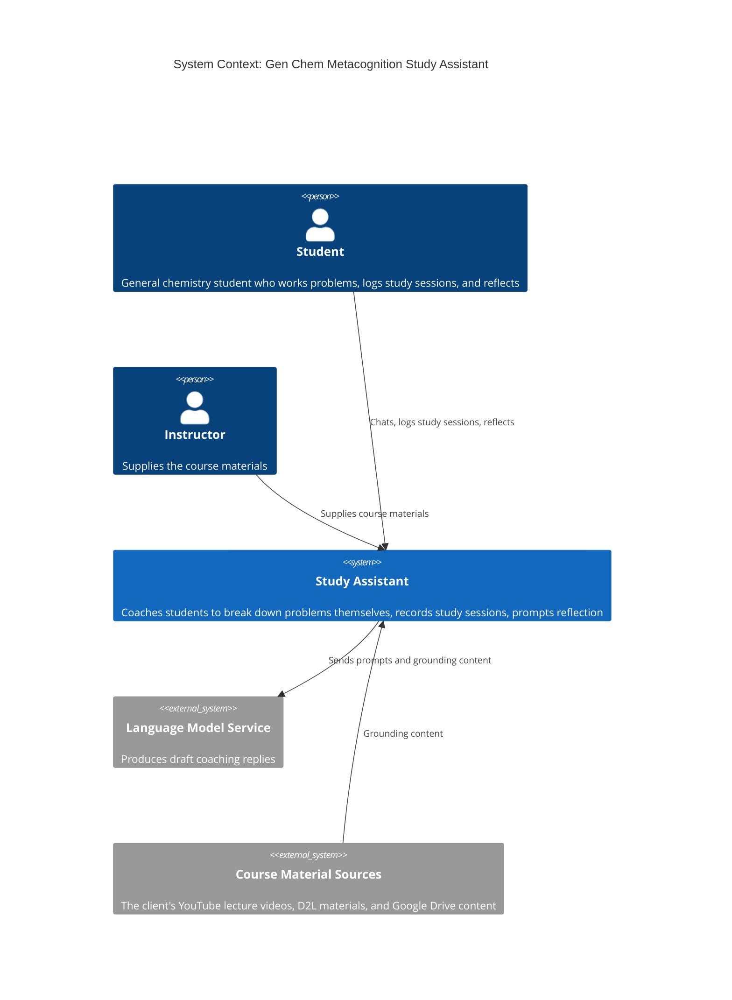
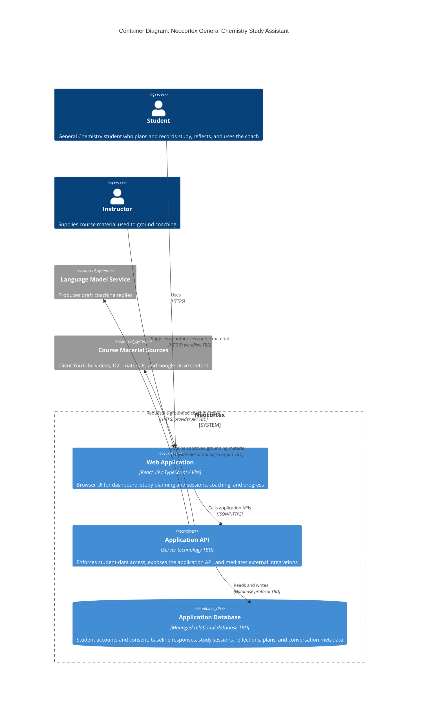
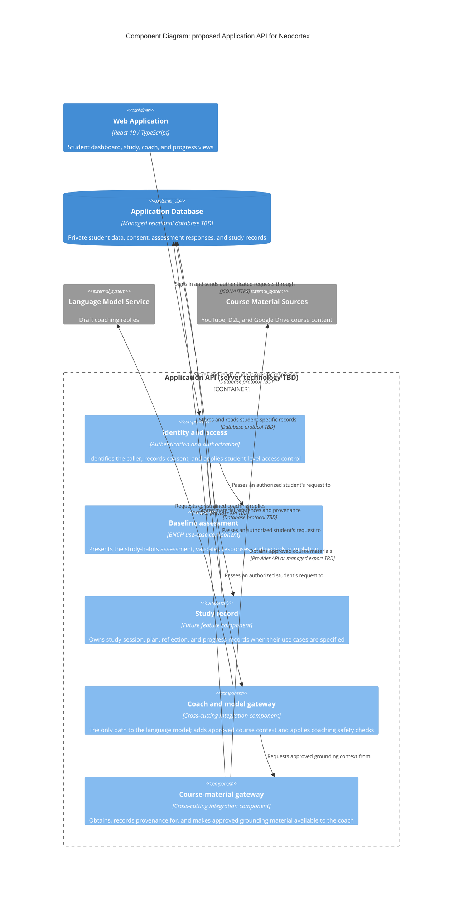
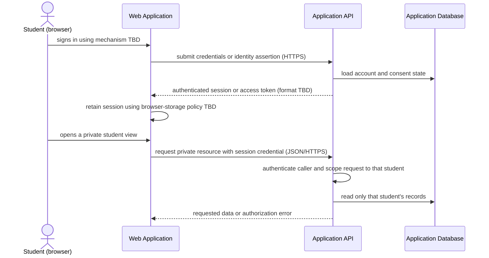
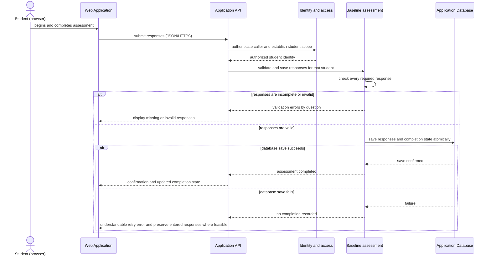
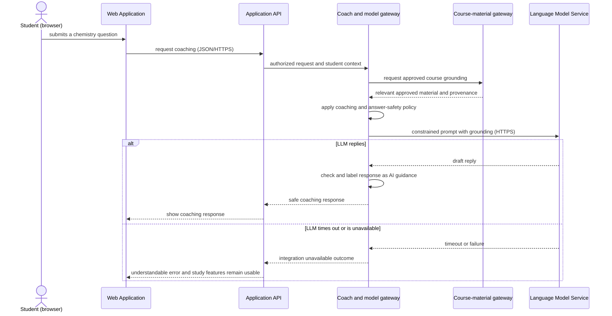

# Architectural Design

**Project:** Gen Chem Metacognition
**Team:** #4
**Client:** Heidi Conrad, Chemistry Department, Texas Christian University
**Version:** 0.1

---

_**How to use this template.** Instructions appear in italic square brackets. Fill in underneath them and leave them in place until the document is stable. Every section says which checkpoint it is due at. A section that is not due yet stays as it is; do not fill it with guesses to make the document look finished._

_**What this document is.** Your system's **architecture-of-record**: the one map of the whole system, every use case area, every component, every external system, and the few decisions that are expensive to change later. It is **breadth-complete and depth-shallow**. Every part of the system is named, and nothing is designed further than its responsibility. How one use case works inside its component is a design-of-record, which comes in week 7, one per use case area, and it is written against real code._

_**What it is not.** A second copy of your requirements. The specification says what the system must do and how well; this document says how the system is shaped to do it. It **cites** `UC-*`, `CO-*`, `SEC-*`, `PER-*` and the rest by identifier and never restates them. A threshold that appears here and nowhere in the specification is a requirement hiding in the wrong document._

_**The test for what belongs here.** Decide now what is hard to reverse, affects the whole system, and is forced by a quality attribute or a constraint: how many deployables, where the data lives, how users sign in, which external systems you depend on. Leave to per-area design what is local and cheap to change: class names, endpoint shapes, table columns._

_**Structure.** The sections follow **arc42** (Starke and Hruschka), with **C4** diagrams (Simon Brown) for context and containers, written as mermaid so they diff in git. All twelve arc42 sections are here in arc42's order, numbering, and titles. The three subsections whose content another document already owns (the requirements overview, the stakeholders, and the quality requirements overview) are kept as one-line links to that document, so the numbering matches arc42's and nothing is written twice. arc42 orders sections by topic, not by when you write them, so Checkpoint 1 covers sections 1–5, 8, and 9, and sections 6 and 7 come later. The full worked example is Project Pulse's [architecture-of-record](https://github.com/Washingtonwei/project-pulse/blob/main/docs/design/architectural-design.md); read it for the shape, then write your own, because your client's quality attributes are not Project Pulse's.]_

## Identifiers

_[The new identifiers this document creates. Everything else it cites keeps the identifier of the document that owns it.]_

| Space | For | Example |
|---|---|---|
| `KD-<slug>` | Key architectural decisions | `KD-single-deployable` |
| `QS-<slug>` | Quality scenarios | `QS-cross-employee-order-denied` |
| `RISK-<slug>` | Technical risks | `RISK-payroll-api-unavailable` |
| `TD-<slug>` | Technical debt the architecture knowingly carries | `TD-no-rate-limiting` |

_[These are slugs, like every other identifier in your project, so an inserted decision renumbers nothing and a citation says what it points at. Project Pulse uses the same form: `KD-modular-monolith`, `QS-cross-team-denial`.]_

## Revision History

| Version | Date | Author | Change |
|---|---|---|---|
| 0.1 | | | Initial draft for Checkpoint 1 |

---

## 1. Introduction and Goals
Neocortex is a metacognition, student-success, and study platform for General Chemistry students. The app utilizes a dynamic chat that encourages student growth and development throughout their coursework. 

### 1.1 Requirements overview

The platform's functional requirements live in the requirements specs under ../requirements/ (a Wiegers/Beatty-style SRS plus use cases, glossary, and business rules), not here. This document realizes those requirements and does not restate them.

### 1.2 Quality goals

> The architecturally significant quality attributes that drive the design, in priority order. The full quality-attribute *requirements* live in the requirements specs; this states the architecture's **response** to the ones that most shape the structure, and [10. Quality Requirements](#10-quality-requirements) makes them measurable.

_[The **three** quality attributes that most shape your system, in priority order. Pick them from section 9 of your [specification](../requirements/software-requirements-specification.md) and cite their identifiers. If you cannot rank them, ask your client which one they would give up first; that answer is the ranking._

_These are usually the top rows of the table in section 9.1, and the two do different jobs. Here, say why each goal matters to your client. There, say which decision it forces._

_Example, from the Cafeteria Ordering System:]_

| Priority | Quality goal | Specification handles | Why it shapes the architecture |
|---|---|---|---|
| 1 | The chatbot guides and never hands over the answer | `SAF-ai-guidance` | The client calls an answer leak a "hard stop" (`SM-no-answer-leak`), and it is the product's one difference from general AI tools. The rule lives mainly in instructions to a general-purpose model, which students can get around by rephrasing (`RI-chatbot-gives-answer`). |
| 2 | A student's study data is seen only by that student | `SEC-authentication`, `SEC-student-isolation` | The system stores identifiable study and reflection data, which is FERPA-protected once combined with grades (`RI-privacy-exposure`). Students already avoid help when they fear judgment, so the coach has to be private. |
| 3 | An outage of an external service does not take the rest down | `ROB-external-service` | The chatbot depends on a hosted language model service the team does not control (`AS-llm-service`). The study timer and study log have to keep working when it is unavailable. |

### 1.3 Stakeholders

Stakeholders are profiled in section 3.1 of [vision and scope](../requirements/vision-and-scope.md).

## 2. Architecture Constraints

_[The constraints the architecture has to honor. They are already written as `CO-*` in section 2.4 of your specification, and `OE-*` in section 2.3; **list the identifiers here, do not restate them.** Add one sentence only where a constraint narrows an architectural choice in a way that is not obvious from its text._

_Your technology stack is a constraint only if something external fixes it: the client's IT department, an existing system, or the person who maintains this after you graduate. A stack your team chose is a decision, and it goes in section 9 with the alternative you rejected.]_

- Students use a web browser on their own laptops and phones, with no installation (vision and scope 3.2 and 4.4). This is an `OE-*` candidate.
- Who hosts, pays for, and maintains the system after the team graduates is undecided (`OI-HOSTING`, `OI-MAINTENANCE` in vision and scope section 5). Vision and scope 4.4 says the answer affects the choice of technology stack, so it is a `CO-*` candidate once the client answers.

## 3. Context and Scope

_Due: Checkpoint 1._

_[One C4 context diagram: your system as a single box, every kind of user, and **every external system** it talks to (email, payment, an identity provider, a client database, an LLM, a file store). An external system discovered halfway through the build is a schedule risk you could have seen at the start._

_Your specification already lists the external systems. Every system named in a software interface (`SI-*`, section 8.3), a communications interface (`CI-*`, section 8.5), or a dependency (`DE-*`, section 2.5) is a box here. A box with none of those behind it is an interface your specification is missing, so add it there too._

_This is your project's one context diagram. Section 4.1 of [vision and scope](../requirements/vision-and-scope.md) holds the first draft: redraw it here in C4, then replace the drawing there with a link to this section, so there is one diagram to keep current._

_arc42 divides context into a **business context** (who and what crosses the boundary) and a **technical context** (the channels and protocols). This diagram is the business context. The protocols go on the arrows of the container diagram in section 5.1._

Redrawn from the first draft in vision and scope 4.1.

## 4. Solution Strategy

_Due: Checkpoint 1._

_[Three to five bullets: the few moves that shape everything else. arc42 suggests four kinds: the technology you build on, how the system is divided at the top level, how the quality goals in section 1.2 are met, and any organizational choice that shapes the code (who maintains what, what you buy instead of build)._

_Each bullet is one sentence, and it cites what explains it: the key decision in section 9.2 where one exists, and otherwise the quality goal and the building block in section 5 it shapes. Keep it short; the reasoning lives in section 9. A bullet that cites nothing is either not load-bearing, or it is a decision you have not written down yet._

- **One component is the only path to the Language Model Service** (Model Gateway, section 5.2), so the reply check that `RI-chatbot-gives-answer` calls for runs in one place (quality goal 1) and a model outage is contained there (quality goal 3).
- **Divided by use case area, with identity resolved in one cross-cutting component** (section 5.2), so the rule that a student reaches only their own records is enforced the same way for every area (quality goal 2).

## 5. Building Block View

_Due: Checkpoint 1. This section is most of what your TA checks._

### 5.1 Containers

Neocortex has three target containers: the React single-page application that runs on the student's device, one server-side application API, and one durable data store. The SPA is already the implemented frontend shell; the API and database are proposed target containers, not present in the current frontend-only milestone. They are separated because browser code cannot safely hold credentials for the language model or enforce server-side student isolation. The final server technology, database product, hosting, and whether the SPA is served by the API remain open under `OI-HOSTING` and `OI-MAINTENANCE`; this view deliberately does not turn those open issues into a premature deployment decision.

### 5.2 Use case areas and components

The component view zooms into the proposed Application API. `BNCH` is the only use-case area currently defined in [the use-case list](../requirements/use-cases.md#3-use-case-list); the remaining rows are cross-cutting homes for the external systems and system-wide rules already in scope. They are all provisional until a use case establishes and tests their boundaries. The React implementation currently has page-level prototype components under `gen-chem-mc/src/`; it has no API packages yet, so these names are responsibilities rather than claimed code packages.

Every student-specific request first reaches **Identity and access**, which is the intended enforcement point for `SEC-authentication`, `SEC-student-isolation`, and consent before any future D2L grade use (`SEC-grade-consent`). The **Baseline assessment** component is the home of `UC-BNCH-complete-baseline-assessment`: it owns assessment questions, response validation, the student association, and completion state. It depends on Identity and access for the caller's identity, rather than accepting a student identifier supplied by the browser.

The other components exist because their responsibilities cut across individual screens and feature use cases. **Coach and model gateway** is the sole integration path to the Language Model Service, concentrating the guidance and transparency safeguards required by `SAF-ai-guidance` and `SAF-ai-transparency` and isolating an LLM failure from study recording (`ROB-external-service`). **Course-material gateway** is the sole home for the three external content sources named in section 3. **Study record** is a deliberately provisional home for the planned timer, manual study log, study plan, reflections, and progress view; it must be split or revised when their use cases are written, rather than treating the current prototype pages as a completed backend design. No D2L grade-reading component is drawn: that feature is postponed and requires approval and explicit student consent.

| Use case area | Component | Responsibility | Depends on | Status |
|---|---|---|---|---|
| `BNCH` | Baseline assessment | Owns the baseline study-habits assessment, its response validation, and each student's completion state. | Identity and access; Application Database | provisional |
| _(cross-cutting)_ | Identity and access | Identifies each caller, records consent, and ensures a student can reach only their own private records. | Application Database; identity-provider decision TBD | provisional |
| _(cross-cutting)_ | Coach and model gateway | Is the only component that sends coaching requests to the Language Model Service and applies approved course context and safety checks. | Identity and access; Course-material gateway; Language Model Service | provisional |
| _(cross-cutting)_ | Course-material gateway | Obtains approved course material and preserves the source/provenance needed to ground coaching. | Course Material Sources; Application Database | provisional |
| _(future use-case areas)_ | Study record | Owns study sessions, plans, reflections, and progress records after their use cases define the boundaries. | Identity and access; Application Database | provisional |

## 6. Runtime View

Key runtime scenarios show how Neocortex's building blocks collaborate. The physical topology belongs in [Deployment View](#7-deployment-view). The current frontend prototype has no authentication, API, database, or external integrations, so these are target flows derived from the confirmed use case and quality requirements; the API routes, identity mechanism, and provider contracts remain to be designed.

### 6.1 Authentication and an authorized request

The Application API is the trust boundary. The browser never selects the student whose private records it can read; the API derives that identity from the authenticated session and scopes every data access to it. This is the runtime enforcement point intended for `SEC-authentication`, `SEC-student-isolation`, and, before any future D2L grade use, `SEC-grade-consent`. The credential type and issuing identity provider are deliberately not named because neither has been selected.

### 6.2 Baseline-assessment submission — `UC-BNCH-complete-baseline-assessment`

This is the first confirmed end-to-end server flow. Completion is returned only after the database has saved both the valid responses and the completion state, so a failed save cannot leave the student marked complete. The browser may retain unsaved responses for retry, but the exact client-storage mechanism remains a design decision; the required behavior is the retry-preservation rule in `UC-BNCH-complete-baseline-assessment` and `ROB-invalid-data`.

### 6.3 AI coaching request — future feature flow

The coach gateway is the only component that contacts the Language Model Service. It obtains only approved course context from the course-material gateway and applies the product's guidance and transparency controls before a response reaches the browser (`SAF-ai-guidance`, `SAF-ai-transparency`). A language-model failure ends only the coaching request; it does not block study-session, assessment, planning, reflection, or progress operations (`ROB-external-service`). This flow is provisional until the coach use case, provider API, and safety-review design are established.

## 7. Deployment View

_Due: Checkpoint 3. [Filled in once your pipeline exists, after week 11. Three things:_

- _**Where each container runs.** Every container in section 5.1 is mapped to the host, service, or device it runs on, in each environment you have (at least development and production). A table is enough; a diagram helps once there are more than two hosts._
- _**How a change gets there.** From a merged pull request to production: what builds it, what tests it, and where it is released first._
- _**What survives a restart.** Which state is in the database or a file store, and which is lost when the application restarts._

_Section 4.4 of [vision and scope](../requirements/vision-and-scope.md) says who can operate the system and where its users are. Cite it; this section says how the deployment meets it.]_

## 8. Crosscutting Concepts

_[arc42 leaves this section an open list of concepts. This template fixes its first entry, 8.1 Security, because Checkpoint 1 asks for the trust boundary; 8.2 holds every other concept.]_

### 8.1 Security

_Due: named at Checkpoint 1, detailed at Checkpoint 2._

_[Four short paragraphs. The last three each cite the `SEC-*` requirement they answer:_

**Trust boundary.** The Application container is the trust boundary. The browser running the Web Front End, the Language Model Service, and the Course Material Sources sit outside it. Every request that crosses the boundary is authenticated and authorized, and that covers every path the Application answers, framework endpoints included.

**Authentication.** **TODO(team):** how a student proves who they are, and who issues the credential. This is undecided in the requirements: vision and scope lists it as open (`OI-ANONYMITY`, `OI-PRIVACY`), and `FEAT-account-consent` is still a candidate feature. Whatever is chosen has to satisfy `SEC-authentication`, and `SEC-passwords` applies only if the system stores passwords itself. If the answer tonight is provisional, say so here and name the open issue.

**Authorization.** There are two roles, student and instructor. A student may reach only their own study data (`SEC-student-isolation`), and the Application checks that on every request by the signed-in student's identity, never by an identifier the browser supplies. **TODO(team):** what the instructor may see. Vision and scope 3.1 says an instructor view is "not yet specified"; until it is, state that the instructor sees no individual student's data.

**Sensitive data.** The Database stores each student's baseline responses, study sessions, reflections, and chat history, all identifiable (`RI-privacy-exposure`). The Language Model Service receives the content of a student's chat messages. No grades are stored in the MVP, and none may be imported without the student's explicit choice (`SEC-grade-consent`). **TODO(team):** retention and disposal are not written yet; section 7.4 of the specification is empty and the question is open with the client (`OI-PRIVACY`), so cite 7.4 once it exists. **TODO(team):** say whether anything that identifies the student is sent to the Language Model Service along with the message.

_Secrets (passwords, API keys, connection strings) never appear in this document or in the repository. Say where they will live, not what they are.]_

### 8.2 Other concepts

_Due: Checkpoint 1, a subsection for every concept in the table below; then kept current, adding the file that shows each rule once code exists and a new concept whenever one appears. [Anything every component must do the same way. Your agent starts every session with no memory of the last, so a convention that is not written here gets reinvented each time. Write every concept now, while each is still cheap to choose; the last column says when a missing one would start to hurt._

_One short subsection each: the rule in one sentence, why, and the file that shows it done right once one exists. Put the one-line instruction in your charter too, citing this subsection, because the charter is what your agent always reads. Project Pulse's Crosscutting Concepts section is a worked example; its headings differ from this template's.]_

| Concept | The question it settles | When it usually bites |
|---|---|---|
| _Error handling_ | _What does a failure look like to the caller, and where is it caught?_ | _The second endpoint_ |
| _Time and time zones_ | _Whose clock decides a deadline, what zone is stored, and can a test set the time?_ | _The first deadline or "submitted late"_ |
| _API conventions_ | _What shape does every response take, and how are endpoints named?_ | _The second endpoint_ |
| _Code conventions_ | _Which libraries and idioms does every file use, and which are banned? (Formatting belongs to a formatter, not here.)_ | _The first file an agent writes_ |
| _Validation_ | _Where is input checked, and which check is the one that counts?_ | _The first form_ |
| _Configuration and secrets_ | _What differs between development and production, and where does it live?_ | _The first deploy_ |
| _Logging_ | _What is logged, at what level, and what must never be?_ | _The first bug you cannot reproduce_ |
| _Persistence and concurrency_ | _Where does a transaction begin and end, and what happens when two people edit at once?_ | _The first shared record_ |
| _Auditing_ | _Who changed what, and when?_ | _The first "who did this?"_ |
| _Testing_ | _Which kinds of test, at which layer, with what data?_ | _The first pull request_ |

**8.2.1 Error handling.** _Draft._ Every failure reaches the caller in one error shape produced in one place in the Application, and no response carries an exception's own message. Why: `ROB-external-service` requires an understandable message when an external service is down while the rest of the system stays usable, and an exception's message can reveal what is behind the Application.

**8.2.2 Time and time zones.** _Draft._ The Application's clock decides every timestamp, times are stored in one standard format in UTC, and tests can set the clock. Why: `INT-calendar` requires a standardized date and time format, and the study log records time of day (`FEAT-study-session-log`), which is wrong if each browser's clock is trusted.

**8.2.3 API conventions.** **TODO(team):** the one shape every response takes and how endpoints are named, in one sentence, with the reason. Depends on the stack.

**8.2.4 Code conventions.** **TODO(team):** the libraries and idioms every file uses and the ones that are banned, in one sentence, with the reason. One rule already follows from section 5.2: no component other than Model Gateway calls the Language Model Service.

**8.2.5 Validation.** _Draft._ Input is checked in the Application before anything is saved, and that check is the one that counts; a check in the Web Front End is only a convenience. Why: `ROB-invalid-data` requires invalid or incomplete data to be rejected with a message, and the browser sits outside the trust boundary (section 8.1).

**8.2.6 Configuration and secrets.** _Draft._ Everything that differs between development and production, and every secret, is read from the environment the Application runs in and never committed to the repository. Why: the language model key and the database credentials are secrets (section 8.1), and `MNT-setup` requires a new developer to configure the system from the README. **TODO(team):** name where the values live once hosting is decided (`OI-HOSTING`).

**8.2.7 Logging.** _Draft._ The Application logs events and errors, and never logs the content of chat messages, reflections, or baseline responses. Why: that content is the identifiable student data named in `RI-privacy-exposure`, and a log is a second copy of it that `SEC-student-isolation` does not protect. **TODO(team):** the log levels.

**8.2.8 Persistence and concurrency.** **TODO(team):** where a transaction begins and ends and what happens when two writes meet, in one sentence, with the reason. Depends on the stack. One fact to build on: in the MVP every record belongs to a single student (`SEC-student-isolation`), so two people never edit the same record.

**8.2.9 Auditing.** **TODO(team):** who changed what and when, in one sentence, with the reason. No requirement in the specification asks for an audit trail yet; if the team decides none is needed for the MVP, write that as the rule and say why.

**8.2.10 Testing.** _Draft._ Every pull request runs automated tests, and every release runs the team-maintained adversarial prompt set against the chatbot. Why: `SM-no-answer-leak` is measured by that test set and its target is zero leaks. **TODO(team):** the kinds of test at each layer and the test data, which depend on the stack.

## 9. Architecture Decisions

_Due: the table and one decision at Checkpoint 1; more as they are made._

### 9.1 Architecturally significant requirements

_[Not every requirement shapes the architecture. The **architecturally significant requirements** are the few that do: quality attributes and constraints where a wrong guess costs a redesign, not a bug fix. Functionality can be delivered by many structures; these are what choose among them._

_Your quality goals from section 1.2 are usually the top rows; cite them by identifier and do not explain them again. This table can also hold what is nobody's goal but still forces structure, such as a `CO-*` constraint._

_List three to six, ranked by importance to your client times difficulty to achieve. Reuse the specification's identifiers, never new ones. **At least one row is a `SEC-*` attribute.** Every system your team builds this year holds some personal data, and if no security requirement appears here, that data's protection was never designed; it will be added later, which is where security bugs come from.]_

| Rank | Requirement | Specification handles | Importance × difficulty | Drives |
|---|---|---|---|---|
| 1 | The chatbot guides and never hands over the answer | `SAF-ai-guidance` | High × High | Model Gateway as the only path to the model (section 5.2) |
| 2 | A student's data is reached only by that student | `SEC-authentication`, `SEC-student-isolation` | High × Medium | The trust boundary and the authorization rule (section 8.1) |
| 3 | An external outage does not take the rest down | `ROB-external-service` | Medium × Medium | Model Gateway isolating the Language Model Service (section 5.2) |
| 4 | The expected load is small and known | `SCA-concurrent-users`, `AVL-uptime` | Medium × Low | `KD-deployment-shape` |
| 5 | A new developer can set it up from the README | `MNT-setup` | Medium × Low | `KD-deployment-shape` |

### 9.2 Key decisions

_[One entry per key decision (`KD-*`), in the form below; it is what the wider industry calls an architecture decision record (ADR). Checkpoint 1 requires exactly one: **`KD-deployment-shape`**, whether your system ships as one deployable or several, and why. Every team makes this decision, and it is where over-engineering usually shows up first. Add others when you make them; do not invent them to fill the section._

_A decision without a **rejected alternative** is not a decision, it is a description. Name what you did not do and why not, so the next person does not redo the argument._

_A decision that turns out wrong is not deleted or rewritten. Mark it **Superseded by `KD-<new-slug>`** and write the new decision as its own entry, so the reasoning behind both stays readable._

- **Driving requirements:** **TODO(team):** the candidates in the specification are `SCA-concurrent-users`, `AVL-uptime`, and `MNT-setup`. Name the ones that actually drove the choice.
- **Context:** About 185 students in one course with one instructor (vision and scope 3.2), and an MVP limited to that course (`AS-freshman-scope`). Nobody has been identified to host or maintain the system after the team graduates (`OI-HOSTING`, `OI-MAINTENANCE`).
- **Decision:** **TODO(team).**
- **Rejected:** **TODO(team):** the alternative the team did not choose, and why not.
- **Trade-off:** **TODO(team):** what the choice costs, and the requirement that would have forced the other answer. A school-wide rollout (`FEAT-school-wide`, postponed) is the kind of requirement to consider.

## 10. Quality Requirements

### 10.1 Quality requirements overview

The quality requirements are in section 9 of the [specification](../requirements/software-requirements-specification.md).

### 10.2 Quality scenarios

_Due: one scenario at Checkpoint 2; one per top-ranked requirement in section 9.1 by Checkpoint 3._

_[A quality attribute says how good; a scenario says how you will know. Each one is: a **source** does a **stimulus** in an **environment**, the system gives a **response**, and a **measure** tells you it worked. The measure cites the specification's attribute for its number; it never introduces one._

_**Verified by** names the test, or the repeatable manual check, that shows the measure holds. Leave it empty until that test exists; an empty cell is an honest "not yet verified".]_

| ID | Source and stimulus | Environment | Response | Measure | Verified by |
|---|---|---|---|---|---|
| _`QS-cross-employee-order-denied`_ | _A signed-on patron requests another patron's order by its ID_ | _Normal operation_ | _Refused before any order data is read_ | _Every such request is refused and returns no order fields (`SEC-employee-own-orders`)_ | _An integration test that signs in as one patron and requests another patron's order_ |
## 11. Risks and Technical Debt

_Due: Checkpoint 2, kept current after._

_[**Technical** risks and debt only. Business risks are `RI-*` in [vision and scope](../requirements/vision-and-scope.md); do not copy them here. Project risks, such as a teammate dropping the course, belong in neither document. Seed this list from the technical `RI-*` items and from any [OPEN-ISSUES.md](../requirements/OPEN-ISSUES.md) entry whose answer could change the architecture._

_A **risk** might happen: an external system you have never called, a client dataset you have never seen. **Debt** has already happened: a shortcut you took on purpose and intend to pay back. Each row says how you would find out, or how you would fix it._

_A risk written as a category ("security", "performance") is not a risk. Write the mechanism: what fails, and what that breaks.]_

| ID | Type | What could go wrong, and what it breaks | Mitigation or fix | Cites |
|---|---|---|---|---|
| _`RISK-payroll-api-unavailable`_ | _Risk_ | _Nobody has seen the Payroll System's interface. If it only accepts a nightly batch file, ordering cannot confirm payment at order time._ | _Ask for the interface document at the next client meeting; build Payment against a stub until then._ | _`DE-payroll-integration`, `OI-4`_ |

## 12. Glossary

Domain terms are defined in the [project glossary](../requirements/project-glossary.md).

---

## Working this document with your agent

_[Delegate: drawing the C4 diagrams in mermaid from your use case list and your specification's interfaces; checking that every use case area has a component and every external system has a component that depends on it; checking that every identifier this document cites exists in the document that owns it; drafting the rejected alternative for a decision you have already made._

_Keep human: the ranking in section 9.1 and every `KD-*`. The decisions are the part of this document your client and the team that inherits this system will hold you to, and they depend on facts about your client that are not in any file._

_**The specific failure to watch for: over-engineering.** Ask an agent for an architecture and it will propose the one it has seen most often in writing, which is built for a company a thousand times your size: microservices, a message queue, Kubernetes, a cache in front of a database that holds ten thousand rows. Every one of those is a real answer to a problem you do not have, and each one adds something that can break at 2 a.m. with nobody to fix it. For every container and every decision the agent proposes, ask which requirement in section 9.1 forces it. If the answer is none, cut it.]_
