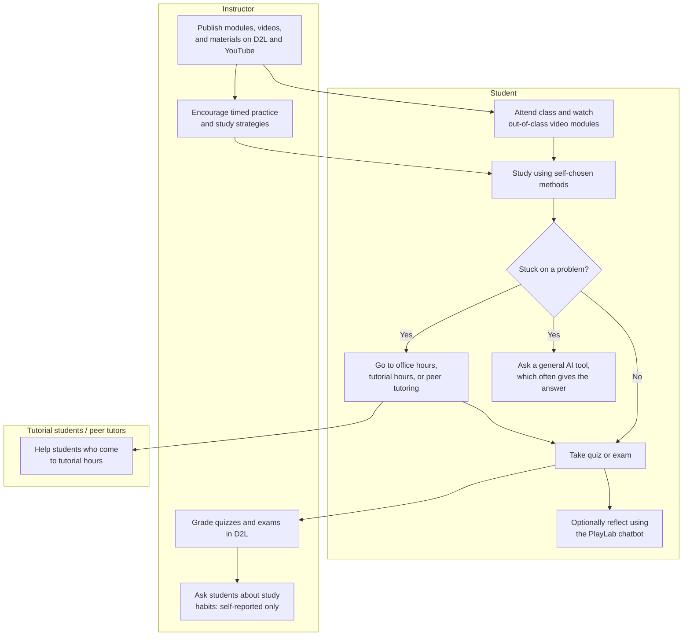
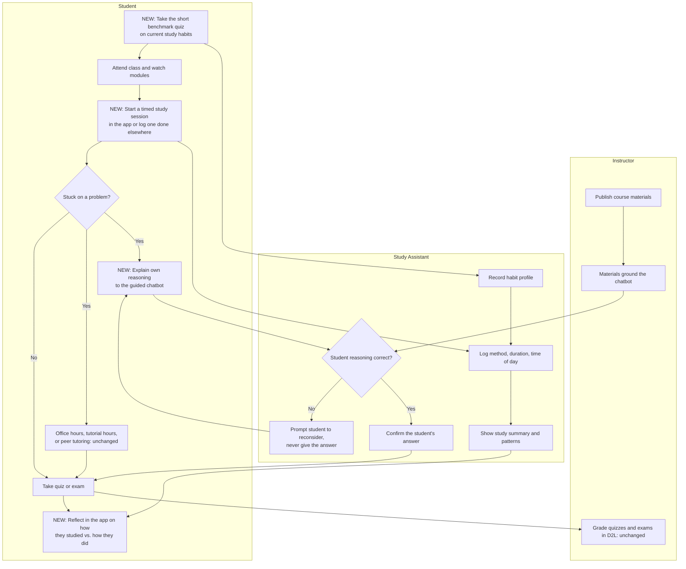
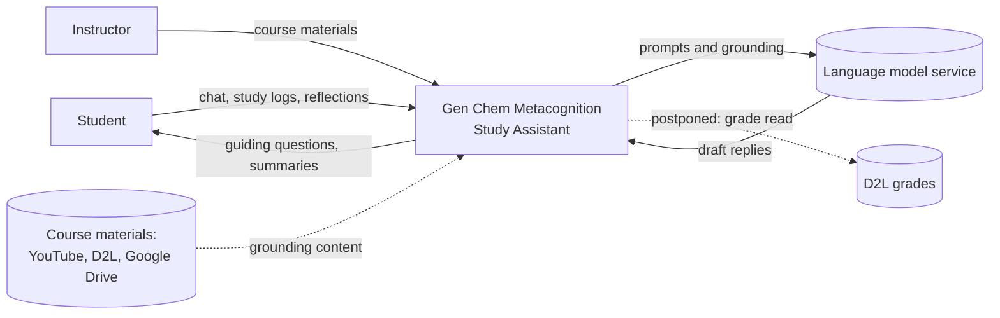

# Vision and Scope

**Project:** Gen Chem Metacognition Study Assistant
**Team:** Team #4
**Client:** Heidi Conrad, Chemistry Department, Texas Christian University
**Version:** 0.2

---

## Identifiers

Every item in this document carries a stable, name-based identifier. Other documents cite these identifiers instead of repeating the text.

| Space | For | Example |
|---|---|---|
| `BO-<slug>` | Business objectives | `BO-problem-dissection` |
| `SM-<slug>` | Success metrics | `SM-no-answer-leak` |
| `FEAT-<slug>` | Product features | `FEAT-guided-chatbot` |
| `RI-<slug>` | Business risks | `RI-chatbot-gives-answer` |
| `AS-<slug>` | Assumptions and dependencies | `AS-d2l-access` |

Business rules (`BR-*`) live in [business-rules.md](business-rules.md). Open questions (`OI-*`) come from the [client interview notes](../meetings/client-interview-2026-09-08.md) and belong in [OPEN-ISSUES.md](OPEN-ISSUES.md).

## Revision History

| Date | Version | Description | Author |
|---|---|---|---|
| 2026-09-11 | 0.1 | Initial draft from client brief and interview notes | Team + Instructor |
| 2026-09-25 | 0.2 | Moved content into template sections and removed the duplicated Introduction. Aligned objectives with the interview notes (replaced `BO-metacognition`, `BO-study-habits`, and `BO-guided-not-answered`, which is a business rule: `BR-no-direct-answers`). Marked unconfirmed metric targets as TBD. Moved `FEAT-d2l-grades-read` to Postponed. Added features discussed with the client. Filled background, process flows, stakeholders, and context from the interview. | Sam Shema |

---

## 1. Introduction

### 1.1 Background

Heidi Conrad teaches general chemistry in the Department of Chemistry at Texas Christian University (TCU). Her current course has about 185 students, mostly freshmen. The fall course is partially flipped: of about 90 modules, about 30 are completed outside class through lecture videos.

Many freshmen arrive without knowing how to study for a college-level course. Their backgrounds range from one year of high-school chemistry, to AP Chemistry, to repeating the college course. Common patterns include memorizing instead of reasoning, very long but unfocused study sessions, difficulty breaking down word problems, and fear of admitting they do not know how to study or solve something.

The client has already built and tested a chatbot on **PlayLab**. It asks students what they know, refuses requests for answers, catches inconsistencies, and confirms correct reasoning. PlayLab is nonprofit-hosted and its long-term support is uncertain, so the client wants a new, independent application built on the same concept. Long term, she would like to seek IRB approval, connect consenting students' usage data with grades, evaluate whether the intervention improves outcomes, and possibly publish the results.

Domain terms used here (metacognition, DFW, IRB, D2L) are defined in the [project glossary](project-glossary.md).

### 1.2 Current Process Flows (As-Is)

Today, students attend class, complete out-of-class video modules, and study on their own with whatever methods they already use. When stuck, they can go to office hours, the department's tutorial hours (more than 30 hours per week, staffed by students who earned an A or A- in Chemistry I and II), or peer-to-peer tutoring. Many instead turn to general AI tools that simply give the answer. The instructor encourages timed practice, for example four or five random questions in 10 minutes before a 12-minute quiz. After quizzes and exams, a small number of students reflect using the PlayLab chatbot, which was designed mainly for post-assessment reflection but can also guide students through problems.

**Current tools and their limitations**

| Tool | Used for | Limitation |
|---|---|---|
| D2L | Course materials, quizzes, grades | Holds grades but nothing about how students studied |
| YouTube | Lecture videos | No link to study behavior |
| Google Drive | PowerPoints and course materials | Not connected to any study tool |
| PlayLab chatbot | Guided questioning and reflection | Long-term hosting and support uncertain; only a few students have tried it; can be too encouraging or verbose for some users |
| General AI tools (e.g., ChatGPT) | Getting help on problems | Give the answer, so students skip the reasoning they will need on exams |
| Office hours, tutorial hours, peer tutoring | Human help | Office hours can get crowded enough that some students leave rather than ask |

**Pain points**

- **Study habits are invisible.** The instructor knows how students studied only from self-reports, so neither she nor the students can tell which habits actually work.
- **Students skip the reasoning.** A student stuck on a word problem can get the answer from a general AI tool in seconds, and then cannot break down a similar problem alone on a 12-minute quiz.
- **Fear of judgment.** Students who feel overwhelmed in a crowded office hour leave without asking for help.

### 1.3 References

| Reference | Date | Where to find it |
|---|---|---|
| Client project brief, "Gen Chem Metacognition: A General Chemistry Success Coach" | Fall 2026 | Course materials (cited in [business-rules.md](business-rules.md)) |
| Initial client meeting notes | 2026-09-11 | [client-interview-2026-09-08.md](../meetings/client-interview-2026-09-08.md) |
| Printed research summary handed to the team | 2026-09-11 | Physical copy held by the team |
| Existing PlayLab chatbot | Current | Access to be provided by the client |
| Course lecture videos | Current | Client's YouTube channel |
| Course shell and grades | Current | D2L (access to be provided by the client) |
| Course PowerPoints and materials | Current | Client's shared Google Drive |
| "Bounce Back" student-feedback material and metacognition resources | Current | To be provided by the client |
| Napkin Round 0 | 2026-09 | [napkin-round-0.md](../napkin-round-0.md) |

---

## 2. Business Requirements

### 2.1 Business Opportunity or Problem Statement

Freshmen in general chemistry often have not yet developed effective college study habits or the ability to break down problems. They memorize instead of reasoning, cannot tell which of their study habits work, and are often afraid to ask for help. General AI tools make this worse by handing them answers, so they never practice the thinking they must do alone on quizzes and exams.

The client wants a study coach, not a content tutor. It should guide students to break down problems themselves, help them notice and reflect on their study patterns without judgment, and eventually provide evidence of whether using it is associated with better grades. The existing PlayLab prototype shows that the approach works for a few students, but it cannot be relied on long term.

### 2.2 Business Objectives

Quantities and baselines have not been set with the client yet (`OI-SUCCESS-METRICS`, `OI-BASELINE-DATA`). Each objective states what we currently know.

| Identifier | Objective | Baseline | Source |
|---|---|---|---|
| `BO-problem-dissection` | Improve students' ability to break down and reason through chemistry problems without being given the solution. | Client reports this is a recurring difficulty; not measured. | Interview §3 |
| `BO-study-awareness` | Help students identify which study behaviors (method, timing, duration) appear to work for them. | Study habits are self-reported only. | Interview §3–4 |
| `BO-self-reflection` | Support nonjudgmental reflection after studying, quizzes, and exams, so students recognize their own patterns. | Only a small group uses the PlayLab reflection bot. | Interview §3 |
| `BO-freshman-transition` | Help freshmen moving from high school develop effective, self-directed college study habits. | Unknown. | Interview §3, §8 |
| `BO-outcome-evidence` | Eventually evaluate whether use of the system is associated with improved grades, without implying causation. | No research design yet; requires IRB (`OI-IRB`). | Interview §1, §3 |

The requirement that the system guides but never gives answers is a business rule, `BR-no-direct-answers`, not an objective. It governs every chatbot feature below.

### 2.3 Success Metrics

| Identifier | Metric | Baseline | Target | How measured | Objective |
|---|---|---|---|---|---|
| `SM-no-answer-leak` | Share of adversarial test prompts (e.g., "just check if 2.5 mol is right", "give me a worked example with the same numbers") for which the chatbot reveals the answer or performs the breakdown | Not yet measured | 0% (the client calls this a "hard stop") | Team-maintained test set run before each release | `BO-problem-dissection` |
| `SM-student-adoption` | Share of students enrolled in the pilot course who use the app at least once before the first quiz | 0 (new app) | TBD with client; the team proposes 60% (unconfirmed) | Enrollment count vs. app login logs | `BO-freshman-transition` |
| `SM-session-logging` | Median number of study sessions logged per active student per week | 0 (not tracked today) | TBD with client | App session logs | `BO-study-awareness` |
| `SM-reflection-completion` | Share of active students who complete at least one reflection after a quiz or exam | Unknown (PlayLab usage is small) | TBD with client | App reflection logs | `BO-self-reflection` |
| `SM-grade-association` | Association between logged study behavior and quiz/exam performance for consenting students | None | TBD; depends on IRB approval and research design (`OI-IRB`, `OI-GRADE-ANALYSIS`) | Grades + app logs, analyzed after the semester | `BO-outcome-evidence` |

### 2.4 Vision Statement

| | |
|---|---|
| **For** | freshmen in TCU general chemistry |
| **Who** | struggle to break down problems and do not yet know which study habits work for them |
| **The** Gen Chem Metacognition Study Assistant | is a web application |
| **That** | coaches students to break down problems themselves, tracks their study sessions, and prompts nonjudgmental reflection on how they studied |
| **Unlike** | general AI tools that hand out answers, and the current PlayLab prototype whose long-term support is uncertain |
| **Our product** | never gives the answer, is grounded in the instructor's own course materials, and connects study behavior to reflection in one independent app |

The product name in the frontend is "Neocortex". The team needs to pick one name and add it to the [glossary](project-glossary.md).

### 2.5 Proposed Process Flows (To-Be)

| Change | Pain point addressed |
|---|---|
| Study sessions logged in the app (timer or manual entry) | Study habits are invisible |
| Guided chatbot that prompts reasoning and never gives the answer (`BR-no-direct-answers`, `BR-student-initiated-breakdown`) | Students skip the reasoning |
| Private, nonjudgmental coach and reflection | Fear of judgment |

**Manual steps that remain:** grading stays in D2L. Human help (office hours, tutorial hours, peer tutoring) stays and is not replaced by the app. Studying done outside the app is self-reported through manual logging. For the MVP, linking grades to study data is done by hand, if at all (see `FEAT-d2l-grades-read`).

### 2.6 Risks

Probability is on a 0–1 scale and impact on a 1–9 scale. Both are team estimates for review with the client.

| Identifier | Risk | Probability | Impact | Mitigation |
|---|---|---|---|---|
| `RI-chatbot-gives-answer` | The "never give the answer" rule lives mainly in instructions to a general-purpose language model, so students get around it by rephrasing ("just check my answer", "show a similar example with the same numbers"). The app's main difference from other AI tools silently disappears. | 0.6 | 9 | Build an adversarial test set early (`SM-no-answer-leak`); add a response check before replies reach the student; test on real student questions from tutorial staff. |
| `RI-d2l-integration-wall` | D2L API access requires institutional approval that takes weeks or never arrives, and the team blocks other work waiting for it. | 0.7 | 6 | Keep grade access out of the MVP; fall back to manual grade export by the instructor for consenting students. |
| `RI-low-adoption` | Too few students use the app to produce meaningful data or benefit (only a small group has tried the PlayLab bot). | 0.4 | 8 | Client demo after the first exam; possible extra credit, pending department approval (`OI-ADOPTION`). |
| `RI-benchmark-survey-noise` | Students guess or answer the benchmark quiz dishonestly, so self-reported habits show no link to actual behavior. | 0.5 | 4 | Keep the quiz to about 5 questions; compare answers with the first two weeks of logged sessions. |
| `RI-privacy-exposure` | The app stores identifiable study and reflection data about students (FERPA-protected when combined with grades). A leak or misuse would harm students and end the research goal. | 0.2 | 9 | Collect only what is needed; get consent before any grade linkage; settle retention with the client (`OI-PRIVACY`, `OI-IRB`). |
| `RI-not-building` | If nothing is built, the PlayLab prototype may lose support and the client loses the tool and any path to research. | 0.4 | 6 | This project. |

### 2.7 Business Assumptions and Dependencies

| Identifier | Assumption or dependency | If false | Owner | Status (2026-09-25) |
|---|---|---|---|---|
| `AS-d2l-access` | The client adds the team to her D2L course shell. | No course content for grounding the chatbot; no path to grades. | Client | Target date 2026-09-20 passed; confirm whether access was granted. |
| `AS-training-data` | The client shares YouTube lecture videos, D2L materials, and Google Drive content in a form the team can use for grounding. | The chatbot is grounded in outside material that may teach concepts differently from her course. | Client | Offered in interview; format not confirmed. |
| `AS-client-available` | The client meets biweekly (Tuesdays 10–11 AM, SWD 203) and answers email between meetings. | Requirements go unconfirmed. | Client | Agreed in interview. |
| `AS-freshman-scope` | The MVP targets only the client's own general chemistry course. | Scope, load, and data-handling needs grow. | Team + Client | Client comfortable with this; exact sections open (`OI-INITIAL-AUDIENCE`). |
| `AS-llm-service` | A hosted language model service with a budget is available to power the chatbot. | No chatbot. | Team + Client | Hosting and budget open (`OI-HOSTING`). |
| `AS-no-lti` | Any D2L integration can use read-only access or a manual export rather than an LTI launch. | Integration effort grows substantially. | Team | Not investigated. |

---

## 3. Stakeholder Profiles and User Descriptions

### 3.1 Stakeholder Profiles

| Stakeholder | Major value or benefit | Attitude | Major features of interest | Constraints | End user? |
|---|---|---|---|---|---|
| Heidi Conrad (client, instructor) | Students who reason independently; visibility into study habits; possible research publication | Supportive | Guided chatbot, reflection, study logging, grade association | Limited time; needs department approval for extra credit and IRB approval for research | Yes (possibly an instructor view, not yet specified) |
| Freshman gen chem students | Better study habits and problem-solving; private, judgment-free help | Unknown; may be wary of being judged, and some will prefer tools that give answers | Guided chatbot, study timer, personal summary | Busy schedules; varied chemistry backgrounds | Yes |
| Tutorial students and TAs | Fewer students arriving without having tried; insight into common difficulties | Unknown | Guided chatbot | Not yet contacted (`OI-REAL-USER-TESTING`) | No |
| Chemistry Department | Better freshman outcomes (e.g., lower DFW rate) | Unknown | Adoption incentives, outcomes | Must approve extra credit | No |
| TCU IRB | Protection of student research subjects | Neutral (gatekeeper) | Consent and data handling | Approval required before research use of grades (`OI-IRB`) | No |
| Future maintainer | A system they can run after the team graduates | Unknown | Hosting, maintainability | Not yet identified (`OI-MAINTENANCE`) | No |

### 3.2 User Environment

- **Users:** about 185 students in the client's current course, one instructor. Broader use across courses is a long-term goal, not the MVP.
- **Task cycle:** students study between classes and before timed quizzes (about 12 minutes) and exams. A study session might be one Pomodoro block; a chatbot session is one problem.
- **Environment:** students' own laptops and phones, anywhere, any time of day. No special constraints identified.
- **Platforms today:** D2L, YouTube, Google Drive, PlayLab.
- **Integration:** course materials are needed to ground the chatbot. D2L grades are wanted long term but not required for the MVP.
- **Concurrent usage, data volume, and retention:** not established.

### 3.3 Alternatives and Competition

| Alternative | Strengths | Weaknesses for this client |
|---|---|---|
| Status quo (self-directed study + human help) | Free, familiar, human support already exists | Habits stay invisible; students fear crowded office hours; no data |
| Keep using the PlayLab chatbot | Already works; the client likes its behavior | Long-term support uncertain; not under the client's control |
| General AI tools (ChatGPT, etc.) | Always available, fast | Give the answer, which defeats the purpose |
| Office hours, tutorial hours, peer tutoring | Human, expert, trusted | Limited hours; crowding; fear of judgment. Stays in place alongside the app, not replaced by it |

---

## 4. Scope and Limitations

### 4.1 Product Perspective

The Study Assistant is a new, self-contained web application. It depends on an external language model service for the chatbot and on the client's course materials for grounding. Integration with D2L grades is postponed.

### 4.2 Major Features

| Identifier | Feature | Governing rules |
|---|---|---|
| `FEAT-guided-chatbot` | A chat coach that asks students to break down a problem themselves, prompts them to reconsider when they are wrong, and confirms only answers they reach on their own. | `BR-no-direct-answers`, `BR-answer-confirmation-only`, `BR-student-initiated-breakdown`, `BR-no-content-teaching` |
| `FEAT-course-grounding` | The chatbot evaluates reasoning using the client's own course materials rather than outside sources, which may teach concepts differently. | `BR-no-content-teaching` |
| `FEAT-benchmark-quiz` | A short (about 5 question) initial survey of the student's current study habits: preferred time of day, session length, and methods used. | |
| `FEAT-pomodoro-timer` | A built-in study timer that records each timed session. | |
| `FEAT-study-session-log` | A record of each study session (method, duration, time of day), from the timer or entered manually for studying done elsewhere, with a personal summary the student can review. | |
| `FEAT-reflection` | Guided, nonjudgmental reflection after a study session, quiz, or exam, comparing how the student studied with how they felt they did. | |
| `FEAT-chat-modes` | A choice between a supportive, encouraging coaching style and a concise, direct one. | |
| `FEAT-study-planning` | Help planning when and how long to study, focused on habits and scheduling, never on course content or predicted exam topics. | `BR-no-content-teaching` |
| `FEAT-account-consent` | Student sign-in and consent choices that decide whether their data may be linked to grades for research. | |
| `FEAT-safety-escalation` | Detecting language that suggests distress and alerting an appropriate person, as the PlayLab prototype does. | |
| `FEAT-d2l-grades-read` | Read-only access to D2L quiz and exam grades for consenting students, for analysis. | |
| `FEAT-assignment-tracker` | Sync assignment deadlines from D2L that stay current when the schedule changes (e.g., weather days). | |
| `FEAT-notifications` | Targeted study reminders (e.g., "chem quiz tomorrow, study 25 min"), without micromanaging. | |
| `FEAT-multi-class` | Coaching study habits across all of a student's courses. | |
| `FEAT-school-wide` | Rollout beyond the client's courses. | |
| `FEAT-leaderboard` | Gamified points or leaderboard, possibly visible only to the instructor (`BR-leaderboard-professor-only`, unconfirmed). | |
| `FEAT-streak` | A counter for consecutive days studied. | |

### 4.3 MVP Scope

**In scope for the MVP (December):** `FEAT-guided-chatbot`, `FEAT-course-grounding`, `FEAT-benchmark-quiz`, `FEAT-pomodoro-timer`, `FEAT-study-session-log`, `FEAT-reflection`.

**Candidates, pending client decision:**
- `FEAT-chat-modes`: the client responded positively but did not commit (`OI-MODES`).
- `FEAT-study-planning`: appears in the frontend (Study page, "Help me plan for my exam"). Needs client confirmation that it stays within `BR-no-content-teaching`.
- `FEAT-account-consent`: the client wants identifiable data for research and possibly anonymous use; the model is not decided (`OI-ANONYMITY`, `OI-PRIVACY`).
- `FEAT-safety-escalation`: requires a policy decision on who is alerted and when (`OI-SAFETY-ESCALATION`). Must be decided explicitly, not left out by default.

**Postponed (after the MVP):**
- `FEAT-d2l-grades-read`: depends on D2L approval and IRB (`RI-d2l-integration-wall`, `OI-GRADE-ACCESS`).
- `FEAT-assignment-tracker` and `FEAT-notifications`: depend on a schedule source that stays current (`OI-SCHEDULE-SOURCE`).
- `FEAT-multi-class`, `FEAT-school-wide`: long-term goal; MVP is one course.
- `FEAT-leaderboard`, `FEAT-streak`: unconfirmed with the client (`OI-GAMIFICATION`).

**Explicitly out of scope:**
- Teaching chemistry content or solving problems for students (`BR-no-content-teaching`).
- Generating content-specific exam study guides or predicting exam content.
- Replacing office hours, tutorial hours, or peer tutoring.

### 4.4 Deployment Considerations

- **Access:** students reach the app through a web browser on their own devices; no installation.
- **Infrastructure:** hosting, the language model service, and their budget are not decided (`OI-HOSTING`).
- **Data:** where student data is stored, who can see it, and how long it is kept are not decided (`OI-PRIVACY`). Any grade linkage needs consent and IRB approval first.
- **Training users:** the client plans to demonstrate the app to students after the first exam.
- **Maintenance:** who owns and maintains the app after the team graduates is not decided (`OI-MAINTENANCE`). This affects the choice of technology stack, so it must be settled early.

---

## 5. Open Issues Raised by This Document

These should be tracked in [OPEN-ISSUES.md](OPEN-ISSUES.md), ordered by what it costs to stay wrong.

| Issue | Question | Blocks |
|---|---|---|
| `OI-SUCCESS-METRICS` / `OI-BASELINE-DATA` | What targets define success for release 1, and what baseline grade, DFW, or study data exists? | All `SM-*` targets |
| `OI-D2L-INTEGRATION` / `OI-GRADE-ACCESS` | Was D2L access granted? What data can be read, with what approval? | `AS-d2l-access`, `FEAT-d2l-grades-read` |
| `OI-HOSTING` / `OI-MAINTENANCE` | Who hosts, pays for, and maintains the app after the team graduates? | `AS-llm-service`, stack choice |
| `OI-ANONYMITY` / `OI-PRIVACY` / `OI-IRB` | Must students sign in? How does anonymous use coexist with research consent? | `FEAT-account-consent` |
| `OI-SAFETY-ESCALATION` | Should distress language trigger an alert, and to whom? | `FEAT-safety-escalation` |
| `OI-INITIAL-AUDIENCE` | Which course sections are in the pilot? | `AS-freshman-scope`, `SM-student-adoption` |
| `OI-MODES` | Should students choose a supportive or concise coaching style? | `FEAT-chat-modes` |
| `OI-STUDY-METHODS` | Which study methods besides Pomodoro and timed practice should be logged? | `FEAT-study-session-log`, `FEAT-benchmark-quiz` |
| `OI-AI-GUARDRAILS` | Exactly when may the chatbot confirm information instead of prompting further? | `FEAT-guided-chatbot` |
| (new) Product name | "Gen Chem Metacognition Study Assistant" or "Neocortex"? | Glossary, UI |
